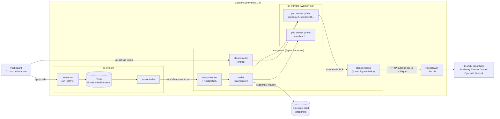

# Atelier AX : orchestrer des agents IA sandboxés sur Kubernetes avec google/ax et Agent Substrate

[AX (Agent Executor)](https://github.com/google/ax) est l'orchestrateur open source de Google pour exécuter des agents IA « à l'échelle du milliard de tâches ». On y déclare des `Task`, `Workspace` et `Model` comme des manifests Kubernetes, et AX les exécute dans des sandboxes isolées, suspendables et reprenables. Il s'appuie sur [Agent Substrate](https://github.com/agent-substrate/substrate), un runtime qui multiplexe des milliers d'« acteurs » (sandboxes gVisor) sur un petit nombre de pods Kubernetes préchauffés.

Dans cet atelier, vous installez la pile complète sur un cluster managé, vous manipulez le cycle de vie des sandboxes (création, `ax ssh`, suspend/resume, densité), vous diagnostiquez un vrai incident d'intégration entre AX et Substrate, puis vous faites corriger un projet Python par un **agent de code (OpenCode)** qui appelle le **LLM du cloud hôte** via une passerelle interne, sans qu'aucune clé ne soit présente dans la sandbox.

> [!WARNING]
> AX (v0.3.1) et Agent Substrate (v0.3.0) sont pré-1.0 : leurs APIs changent d'une version mineure à l'autre. L'atelier épingle toutes les versions dans [versions.env](versions.env) et a été validé de bout en bout le 2026-10-02 sur Scaleway Kapsule 1.37.0, ainsi qu'en local sur k3s 1.37.1 (Colima, Mac M1 Pro). Les écarts constatés avec la documentation amont sont signalés dans le déroulé.

---

## Résumé

- **Niveau** : avancé.
- **Durée cible** : 150 minutes (dont environ 25 minutes de provisionnement et de builds, à lancer en début de séance).
- **Public** : consultants OCTO (Cloud, DevOps, plateformes IA) et participants Octo Academy à l'aise avec Kubernetes.
- **Environnement cible** : un cluster managé Kubernetes **1.37+** par participant ou binôme. **Scaleway Kapsule** par défaut ; variantes GKE, AKS et EKS fournies, ainsi qu'une **variante locale** sur Mac Apple Silicon (Colima + k3s, LLM du poste via LM Studio, Ollama ou équivalent), sans aucun compte cloud.

---

## Objectifs pédagogiques

À la fin de cet atelier, les participants sauront :

- expliquer le découpage entre **AX** (API déclarative `Task`/`Workspace`/`Model`, état dans Redis) et **Agent Substrate** (acteurs, workers, snapshots, routage réseau) ;
- installer la pile sur un cluster managé hors GKE, et identifier ce qui, dans l'installation amont, est propre à GKE ;
- piloter le cycle de vie d'une sandbox avec le CLI `ax` (`apply`, `get`, `describe`, `ssh`, `suspend`, `resume`, `delete`) et l'observer côté Substrate avec `kubectl ate` ;
- expliquer pourquoi suspendre/reprendre un agent coûte quelques secondes et ce qui survit (le volume `/workspace`) ou non (les processus) ;
- diagnostiquer une incompatibilité entre deux couches de readiness (AX et Substrate) à partir des journaux ;
- contrôler la sortie réseau d'une sandbox avec une `EgressPolicy` et garder les identifiants LLM hors des sandboxes grâce à une passerelle.

---

## Concepts manipulés

- **Kubernetes 1.37** : `PodCertificateRequest` et `ClusterTrustBundle` (passés GA en 1.37, indispensables à Substrate), DaemonSet, CRD, NetworkPolicy, kustomize (composants).
- **AX** : `Task`, `Workspace`, `Model`, atespace, runner (`ax-task-runner`, PID 1 des sandboxes), serveur de métadonnées, `ax ssh`.
- **Agent Substrate** : acteur, `ActorTemplate`, golden snapshot, `WorkerPool`, worker, `SandboxConfig` (gVisor), atelet, atenet (router d'entrée et passerelle de sortie), `EgressPolicy`.
- **Sécurité des agents** : isolation gVisor, identité d'acteur (mTLS), contrôle de la sortie réseau, secrets hors sandbox.
- **Outillage** : OpenTofu, ko, Docker buildx, `ax`, `kubectl ate`, LiteLLM, OpenCode.

---

## Compatibilité des clouds

Agent Substrate exige les APIs `certificates.k8s.io` `PodCertificateRequest` et `ClusterTrustBundle`, servies par défaut à partir de **Kubernetes 1.37**. Situation au 2026-10-02 :

| Cloud | Kubernetes 1.37 | Terraform | Registre | Snapshots | LLM de l'agent | Statut |
|---|---|---|---|---|---|---|
| **Scaleway Kapsule** | GA (1.37.0) | [terraform/scaleway](terraform/scaleway) | Container Registry (public) | Object Storage (S3) | Generative APIs (`qwen3-coder-30b-a3b-instruct`) | ✅ validé de bout en bout |
| **Google GKE** | canal RAPID | [terraform/gcp](terraform/gcp) | Artifact Registry | GCS (backend natif) | Vertex AI (`gemini-3.8-flash`) | ⚠️ `tofu validate` uniquement |
| **Azure AKS** | preview (GA annoncée en octobre 2026) | [terraform/azure](terraform/azure) | ACR (lecture anonyme) | rustfs dans le cluster | Azure OpenAI (`gpt-5.1`) | ⚠️ `tofu validate` uniquement |
| **AWS EKS** | non disponible (1.36 max.) | [terraform/aws](terraform/aws) | ECR + ECR Public | S3 (EKS Pod Identity) | Bedrock (`anthropic.claude-opus-5-5`) | ❌ bloqué jusqu'à EKS 1.37 |
| **Local (Colima + k3s)** | k3s v1.37.1 + API `v1beta1` | [local](local) (scripts, sans Terraform) | registre local (`localhost:5001`) | rustfs dans le cluster | LLM du poste (LM Studio, Ollama...) | ✅ validé de bout en bout (Mac M1 Pro, LM Studio) |

Pourquoi ces différences :

- **Registre** : atelet (Substrate v0.3.0) tire lui-même l'image des sandboxes et ne sait s'authentifier qu'auprès des registres GCP. Hors GKE, cette image doit donc être **lisible anonymement** (registre Scaleway public, ACR en lecture anonyme, ECR Public).
- **Snapshots** : l'installation amont écrit dans GCS. Hors GKE, le composant [platform/substrate/non-gke](platform/substrate/non-gke) bascule Substrate sur n'importe quel stockage compatible S3. Azure n'ayant pas d'API S3, un rustfs est déployé dans le cluster.
- **EKS** n'autorise pas l'activation des APIs bêta : impossible d'utiliser la 1.36. Le Terraform AWS est prêt pour la sortie d'EKS 1.37 (la validation de la variable `kubernetes_version` l'impose).
- **API `v1beta1`** : même en 1.37, Substrate v0.3.0 lit et écrit les `ClusterTrustBundles` en `certificates.k8s.io/v1beta1`. Kapsule sert cette version ; k3s ne la sert qu'avec l'option `runtime-config` de la variante locale. Sur EKS 1.37, il faudra vérifier qu'elle est servie par défaut, puisqu'on ne peut pas l'activer. Les scripts le contrôlent avant l'installation.
- **Local** : pas de cloud. Les images sont construites en arm64 et poussées dans un registre du Docker de la VM, et le LLM est celui du Mac (GPU compris), joint depuis le cluster via `host.lima.internal`.

Chaque Terraform produit le même fichier `demos/ax/workshop.env` (voir [terraform/workshop.env.tftpl](terraform/workshop.env.tftpl)) : les scripts et le reste de l'atelier sont identiques sur les 4 clouds. La variante locale produit ce même fichier avec [local/up.sh](local/up.sh).

---

## Architecture cible



Points clés :

- **AX ne crée aucun pod.** `ax-controller` crée un `ActorTemplate` par Task (image + environnement), puis un acteur. Substrate place l'acteur sur un **worker déjà démarré** : c'est ce qui rend la création et la reprise rapides.
- **Un worker héberge plusieurs sandboxes.** Le `WorkerPool` fixe le nombre de pods et leur capacité ; les acteurs y sont empaquetés.
- **Toute sortie réseau d'une sandbox passe par `atenet-egress`**, qui authentifie l'acteur (certificat mTLS propre à chaque acteur) et applique son `EgressPolicy`.
- **Les clés LLM ne quittent pas `llm-gateway`.** La sandbox ne reçoit que l'URL de la passerelle.

---

## Prérequis

### Outils locaux

```bash
tofu version          # OpenTofu 1.6+ (ou terraform)
kubectl version --client   # 1.37+ recommandé
go version            # Go 1.27+ : builds ko de Substrate et d'AX, CLI ax et kubectl-ate
docker buildx version # image des sandboxes
kustomize version     # composant non-gke
git --version; perl -v | head -2
```

- `go`, `ko` et le CLI `ax` : `ko` est lancé via `go run` (version épinglée), rien d'autre à installer. Ajoutez le répertoire où `go install` dépose les binaires à votre `PATH` pour `ax` et `kubectl-ate` : `$(go env GOBIN)` s'il est défini (c'est le cas avec mise), `$(go env GOPATH)/bin` sinon.
- Sur un Mac ARM, l'image des sandboxes (amd64) se construit **sans émulation** : toutes les étapes lourdes du [Dockerfile](images/agent-runner/Dockerfile) tournent sur l'architecture de la machine.

### Accès cloud

**Scaleway (par défaut)** : une clé API avec les droits Kubernetes, Container Registry, Object Storage, IAM et Generative APIs sur un projet.

```bash
cp terraform/scaleway/.envrc.example terraform/scaleway/.envrc   # puis renseignez les valeurs
source terraform/scaleway/.envrc
```

Variantes : `aws sso login` (ou un profil) pour AWS ; `gcloud auth application-default login` et `export TF_VAR_project_id=...` pour GCP ; `az login` et `export ARM_SUBSCRIPTION_ID=...` pour Azure.

### Variante locale : Colima sur Mac Apple Silicon

Aucun accès cloud n'est nécessaire. Il faut un Mac Apple Silicon avec 32 Gio de mémoire et environ 15 Gio d'espace disque libre, [Colima](https://github.com/abiosoft/colima), et un **serveur LLM local** compatible OpenAI (LM Studio, Ollama, llama.cpp...).

**Cluster** : créez un profil Colima dédié, avec k3s 1.37.

```bash
colima start -p kubernetes --cpu 6 --memory 16 --disk 40 \
  --network-address --kubernetes --kubernetes-version v1.37.1+k3s1 \
  --k3s-arg=--disable=traefik \
  --k3s-arg=--kube-apiserver-arg=runtime-config=certificates.k8s.io/v1beta1=true
```

- Le profil s'appuie sur la virtualisation d'Apple (`vz`) et les montages `virtiofs`, choisis par défaut par Colima. Le runtime Docker de la VM sert aussi de runtime au kubelet de k3s.
- k3s doit être en 1.37 : en 1.36, `ClusterTrustBundle` et `PodCertificateRequest` ne sont pas servies sans activer leurs APIs bêta.
- En 1.37, ces APIs sont servies en `v1`, mais Substrate v0.3.0 écrit encore les `ClusterTrustBundles` en `v1beta1`, que k3s ne sert pas par défaut : d'où l'option `runtime-config`. Sans elle, l'installation reste bloquée sur « Waiting for podcertificate ClusterTrustBundles ». Sur un profil existant, ajoutez l'option dans `kubernetes.k3sArgs` du fichier `~/.colima/kubernetes/colima.yaml`, puis redémarrez le profil (`colima stop -p kubernetes && colima start -p kubernetes`).
- Tout tourne en arm64 : l'image des sandboxes, les images de Substrate et d'AX, et gVisor.

**LLM** : il tourne sur le Mac, hors de la VM. La VM Colima n'a pas accès au GPU, et un modèle dans le cluster coûterait plusieurs Go de disque. Le modèle doit :

- **savoir appeler des outils** (OpenCode en dépend) ;
- être chargé avec un **contexte d'au moins 32 000 tokens** : le prompt système d'OpenCode dépasse les 4 096 à 8 192 tokens que LM Studio et Ollama allouent souvent par défaut. Avec un contexte trop court, l'agent tourne en boucle (il relance les tests sans jamais modifier le code). Sous LM Studio : `lms load <modèle> --context-length 32768`, puis vérifiez la colonne `CONTEXT` de `lms ps`. Sous Ollama : `OLLAMA_CONTEXT_LENGTH=32768 ollama serve`.

Notez l'URL du serveur vue depuis le Mac (`http://127.0.0.1:1234` pour LM Studio, `http://127.0.0.1:11434` pour Ollama), l'identifiant du modèle (`curl <url>/v1/models`) et, si le serveur en exige un, son jeton d'API.

---

## Déroulé

Toutes les commandes se lancent depuis `demos/ax/`.

### Étape 0 : Provisionner l'infrastructure (≈ 8 min)

```bash
cd terraform/scaleway   # ou aws, gcp, azure
tofu init
tofu apply
cd ../..
source workshop.env      # exporte KUBECONFIG, IMAGE_REPO, LLM_*...
kubectl get nodes
```

Résultat attendu (Kapsule) :

```text
NAME                                             STATUS   ROLES    AGE   VERSION
scw-ax-workshop-ax-workers-233472a4f35c42569a9   Ready    <none>   4m    v1.37.0
scw-ax-workshop-ax-workers-d0a7b9e37fc646d8afe   Ready    <none>   4m    v1.37.0
```

Authentifiez Docker (et donc ko) auprès du registre de session, avec la commande fournie par le Terraform :

```bash
eval "$(tofu -chdir=terraform/scaleway output -raw registry_login)"
```

Vérifiez que le cluster sert les APIs dont Substrate a besoin :

```bash
kubectl api-resources --api-group=certificates.k8s.io
```

```text
NAME                         SHORTNAMES   APIVERSION               NAMESPACED   KIND
certificatesigningrequests   csr          certificates.k8s.io/v1   false        CertificateSigningRequest
clustertrustbundles                       certificates.k8s.io/v1   false        ClusterTrustBundle
podcertificaterequests                    certificates.k8s.io/v1   true         PodCertificateRequest
```

> Le Terraform crée aussi une **application IAM dédiée** (Object Storage + Generative APIs) : c'est sa clé, et non la vôtre, qui est remise au cluster.

#### Variante locale (≈ 1 min, profil Colima déjà démarré)

Indiquez le serveur LLM du poste (exemple avec LM Studio ; `LOCAL_LLM_API_KEY` est facultatif) :

```bash
LOCAL_LLM_URL=http://127.0.0.1:1234 \
LOCAL_LLM_MODEL=<identifiant-du-modèle> \
LOCAL_LLM_API_KEY=<jeton-si-requis> \
  ./local/up.sh
source workshop.env      # exporte KUBECONFIG, DOCKER_CONTEXT, IMAGE_REPO, LLM_*...
kubectl get nodes
```

```text
NAME                STATUS   ROLES           AGE   VERSION
colima-kubernetes   Ready    control-plane   5m    v1.37.1+k3s1
```

Le script ([local/up.sh](local/up.sh)) remplace `tofu apply` :

1. il vérifie que le serveur LLM répond et connaît le modèle ;
2. il écrit un kubeconfig dédié (`~/.kube/kubeconfig-ax-local`) et vérifie les APIs de certificats ;
3. il démarre un **registre local** sans TLS (`ax-registry`, conteneur du Docker de la VM). Colima le redirige vers `localhost:5001` sur le Mac : ko et Docker y poussent les images, le kubelet les y tire ;
4. il génère `workshop.env` : snapshots dans un **rustfs** déployé dans le cluster (comme sur Azure), images en arm64 uniquement, LLM du poste joint depuis le cluster via `host.lima.internal`, le nom du Mac vu depuis la VM.

Les valeurs `LOCAL_LLM_*` sont conservées dans `workshop.env` : relancer `./local/up.sh` (après un redémarrage de la VM, par exemple) ne demande pas de les repréciser. Pas de `docker login` : le registre local est anonyme.

Un détail mérite l'attention : atelet tire lui-même l'image des sandboxes depuis son pod, où `localhost` désigne le pod et non le nœud. Le composant [platform/substrate/local-registry](platform/substrate/local-registry) lui fait donc réécrire `localhost:5001` vers l'adresse du nœud (option `--localhost-registry-replacement`, celle qu'utilise le cluster kind de développement de Substrate).

### Étape 1 : Installer Agent Substrate (≈ 10 min au premier lancement)

Substrate ne publie pas d'images : son installeur officiel (`cmd/ate-setup`) les construit avec ko depuis le tag épinglé et les pousse dans votre registre.

```bash
./scripts/10-install-substrate.sh
```

Le script ([scripts/10-install-substrate.sh](scripts/10-install-substrate.sh)) :

1. vérifie la version de Kubernetes et les APIs de certificats ;
2. greffe le composant kustomize [platform/substrate/non-gke](platform/substrate/non-gke) sur l'overlay `agentgateway` de Substrate (sauf sur GKE) : snapshots S3, pas d'authentification GCP pour tirer les images, pas de `PodMonitoring` (CRD propre à Google Managed Prometheus) ;
3. crée le Secret `ate-snapshot-storage` (accès S3) ;
4. lance `ate-setup deploy ate-system --atenet-dataplane agentgateway` : CRDs, autorités de certification, contrôleur de certificats de pods, PostgreSQL, API, contrôleur, atelet, router et passerelle de sortie ;
5. crée le `WorkerPool` [ax-workers](platform/substrate/workerpool.yaml) (3 pods gVisor) et installe le plugin `kubectl-ate`.

Observez ce qui a été installé :

```bash
kubectl -n ate-system get pods
kubectl get clustertrustbundles        # les autorités de confiance des certificats de pods
kubectl get workerpools -A
kubectl ate get workers
```

```text
NAME                                   POOL         STATE                 ACTORS   CPU   MEMORY   POD                                      AGE
7e12115e-3aa4-4118-95d6-db2dd78771ad   ax-workers   WORKER_STATE_ACTIVE   0/1000   0/2   0/3Gi    ax-workers/ax-workers-7f8cd69845-885lv   30s
f0a6809d-0cff-4ae6-983d-c7ae203679b9   ax-workers   WORKER_STATE_ACTIVE   0/1000   0/2   0/3Gi    ax-workers/ax-workers-7f8cd69845-mkd8g   29s
88306c60-4ae1-450c-ad2d-c42154263e5f   ax-workers   WORKER_STATE_ACTIVE   0/1000   0/2   0/3Gi    ax-workers/ax-workers-7f8cd69845-zt9gp   29s
```

À retenir :

- Les **workers** sont des pods ordinaires qui attendent des acteurs. Les acteurs, templates et workers ne sont **pas** des objets Kubernetes : ils vivent dans PostgreSQL et se lisent avec `kubectl ate`. Seuls `WorkerPool` et `SandboxConfig` sont des CRD.
- Chaque composant obtient un certificat via un `PodCertificateRequest` signé par `podcertificate-controller` : c'est la raison du prérequis Kubernetes 1.37.
- Les journaux de Substrate signalent toutes les minutes l'échec de l'export OpenTelemetry (`name resolver error: produced zero addresses`) : l'installation amont pointe vers le collecteur géré de GKE. Ces avertissements sont sans conséquence ici.

### Étape 2 : Installer AX (≈ 3 min)

```bash
./scripts/20-install-ax.sh
ax version
ax ctx
```

```text
ax version v1alpha1 (standalone redis engine)
Active Kubernetes Context: admin@ax-workshop
AX Tunnel:                 No background tunnel running (will auto-connect on next command)
```

Le script construit `ax-server` et `ax-controller` avec ko, les déploie dans `ax-system` avec Redis, et installe le CLI. Une seule adaptation est nécessaire : le manifest amont de `ax-controller` pointe les snapshots vers un bucket GCS de développement de Google, remplacé par le vôtre (`AX_SNAPSHOTS_BUCKET`).

Le CLI `ax` suit votre contexte Kubernetes et ouvre lui-même un tunnel vers `ax-server` : aucun Ingress n'est nécessaire.

### Étape 3 : Construire l'image des sandboxes (≈ 5 min)

```bash
./scripts/30-build-agent-image.sh
```

L'[image](images/agent-runner/Dockerfile) contient le runner d'AX (`/usr/local/bin/ax-task-runner`, PID 1 de chaque sandbox), l'agent OpenCode configuré sur la passerelle LLM ([opencode.json](images/agent-runner/opencode.json)), ripgrep, Python et pytest. ripgrep est embarqué parce qu'OpenCode le télécharge sinon au premier appel de ses outils de recherche, et que l'extraction de l'archive échoue dans gVisor.

> **Les images doivent être épinglées par digest.** Substrate refuse un `ActorTemplate` dont l'image n'est désignée que par un tag (`must be pinned by digest`) : un golden snapshot doit rester reproductible. [scripts/render.sh](scripts/render.sh) résout donc le digest et l'injecte dans les manifests des exercices.

### Exercice 1 : Première Task (≈ 10 min)

```bash
./scripts/render.sh tasks/01-hello.yaml | ax apply -f -
ax get tasks
ax describe task hello
```

```text
NAME    ATESPACE   PHASE     ACTOR   WORKER-IP     AGE
hello   default    Running   hello   100.64.0.86   13s

Conditions:
  TYPE            STATUS  REASON         MESSAGE
  WorkspaceReady  True    SetupComplete  Workspace setup completed at 100.64.0.86
  Ready           True    TaskRunning    Task is running and its workspace is ready
```

Entrez dans la sandbox (la Task déclare `debug: true`, qui active les « guest services ») :

```bash
ax ssh hello -- cat /workspace/hello.txt
ax ssh hello -- ps -o pid,comm
ax ssh hello -- sh -c 'curl -s "$AX_METADATA_URL/metadata/v1alpha1/ax/task" | head -8'
```

```text
Linux actor 4.19.0-gvisor #1 SMP Sun Jan 10 15:06:54 PST 2016 x86_64 GNU/Linux
GREETING=Bonjour depuis une sandbox AX
  PID COMMAND
    1 ax-task-runner
   13 sh
```

Puis regardez la même chose côté Substrate :

```bash
kubectl ate get actors -a default
kubectl ate get actor-templates -a default
kubectl get pods -n ax-workers
```

À observer :

- le noyau `4.19.0-gvisor` : la commande s'exécute dans **gVisor**, un noyau applicatif qui intercepte les appels système, et non directement sur le noyau du nœud (`aarch64` au lieu de `x86_64` dans la variante locale) ;
- `ax-task-runner` en PID 1 : il prépare les Workspaces, sert les métadonnées sur le port 80, lance `spec.command` et **reste vivant après la fin de la commande** ;
- un `ActorTemplate` `hello-tmpl-<hash>` a été créé pour la Task, puis un acteur `hello` placé sur un worker existant : **aucun nouveau pod**.

### Exercice 2 : Workspace et incident d'intégration (≈ 20 min)

Un `Workspace` décrit l'environnement de départ d'un agent : dépôts Git à cloner, serveurs MCP, skills. Déclarez-en un qui clone `chalk` et liez-le à une Task :

```bash
./scripts/render.sh tasks/02-workspace.yaml | ax apply -f -
ax get workspaces
ax describe task explorer
```

La Task est `Running` et `WorkspaceReady=True`. Vérifiez pourtant le contenu :

```bash
ax ssh explorer -- sh -c 'ls -a /workspace/chalk; cat /workspace/explorer.txt'
ax ssh explorer -- cat /ax/git-error.log
```

```text
.  ..  .git
fatal: your current branch 'master' does not have any commits yet
---
error: git fetch: exit status 128
fatal: unable to access 'https://github.com/chalk/chalk.git/': gnutls_handshake() failed: The TLS connection was non-properly terminated.
```

**Le dépôt est vide.** Menez l'enquête :

1. La sortie fonctionne-t-elle *maintenant* ?

   ```bash
   ax ssh explorer -- curl -s -o /dev/null -w '%{http_code}\n' https://github.com
   ```

   → `200`. Le réseau n'est donc pas en cause en général, seulement au démarrage.

2. Les journaux d'une sandbox sont dans son pod worker. Retrouvez le moment du clonage :

   ```bash
   WORKER=$(kubectl ate get actors -a default | awk '$2=="explorer" {print $5}')
   kubectl -n ax-workers logs "${WORKER#*/}" | grep '"ate.actor.name":"explorer"' | grep -oE 'msg=\\"[^\\]+\\"[^"]{0,80}'
   ```

   ```text
   msg=\"executing workspace maiden run setup\" path=/workspace
   msg=\"initializing and fetching git repo\" repo=https://github.com/chalk/chalk.git branch=main dir=/workspace/chalk depth=
   msg=\"git operation failed, will retry\" attempt=1 max=5 error=\
   ...
   ```

3. L'explication se trouve dans le code de Substrate ([cmd/ateom-gvisor/main.go](https://github.com/agent-substrate/substrate/blob/v0.3.0/cmd/ateom-gvisor/main.go), `RunWorkload`). Substrate attend que la sonde de démarrage de la sandbox réponde 200, et **n'active la sortie réseau de l'acteur qu'ensuite**. Or la sonde configurée par AX est `/readyz`, qui répond `503` tant que les Workspaces ne sont pas prêts. Le clonage a donc lieu avant l'ouverture du réseau : il échoue 5 fois, le runner abandonne, `/readyz` passe à 200, le réseau s'ouvre... trop tard.

C'est un défaut connu d'AX v0.3.1 : [google/ax#427](https://github.com/google/ax/issues/427) (le clonage a aussi lieu pendant le boot « golden »), [#347](https://github.com/google/ax/issues/347) (`WorkspaceReady=True` malgré l'échec) et [#375](https://github.com/google/ax/issues/375) (même blocage pour les Workspaces décrits par un `goal`).

**Contournement retenu pour la suite** : cloner dans `spec.command`, qui ne démarre qu'une fois la sandbox prête (exercice 5).

### Exercice 3 : Suspend et resume (≈ 15 min)

Écrivez un fichier et lancez un processus dans la sandbox `hello`, puis suspendez-la :

```bash
ax ssh hello -- sh -c 'date > /workspace/memo.txt; nohup sleep 1000 >/dev/null 2>&1 &'
ax ssh hello -- ps -o pid,comm
ax suspend task hello
ax get tasks
kubectl ate get actors -a default
kubectl ate get workers
```

```text
NAME    ATESPACE   PHASE       ACTOR   WORKER-IP   AGE
hello   default    Suspended   hello   <none>      15m
```

L'acteur est `ACTOR_STATE_SUSPENDED`, sans worker. Son état est parti dans le stockage objet (`ax/atespaces/<atespace>/actors/<uid>/snapshots/...`) : par exemple, avec la CLI AWS sur Scaleway :

```bash
AWS_ACCESS_KEY_ID=$S3_ACCESS_KEY_ID AWS_SECRET_ACCESS_KEY=$S3_SECRET_ACCESS_KEY \
  aws s3 ls --recursive --endpoint-url "$S3_ENDPOINT" --region "$S3_REGION" "s3://${SNAPSHOT_LOCATION#gs://}/"
```

Avec rustfs (Azure, variante locale), le stockage n'est joignable que depuis le cluster : ouvrez un tunnel, puis remplacez l'endpoint.

```bash
kubectl -n ate-system port-forward svc/rustfs 9000:9000 &
AWS_ACCESS_KEY_ID=$S3_ACCESS_KEY_ID AWS_SECRET_ACCESS_KEY=$S3_SECRET_ACCESS_KEY \
  aws s3 ls --recursive --endpoint-url http://localhost:9000 --region "$S3_REGION" "s3://${SNAPSHOT_LOCATION#gs://}/"
kill %1
```

Reprenez la Task et comparez :

```bash
ax resume task hello
ax ssh hello -- sh -c 'cat /workspace/memo.txt; ps -o pid,comm'
```

À observer :

- suspend et resume prennent **environ 3 secondes** ;
- `/workspace/memo.txt` a survécu, le `sleep` non : AX configure des snapshots de type `DATA` (le volume durable `/workspace` seulement) ;
- le bucket contient aussi des snapshots sous `ate-golden/tags/...`, plus volumineux (`pages.img`, `checkpoint.img`) : ce sont les **golden snapshots**, images mémoire complètes prises une fois par `ActorTemplate` pour démarrer vite toutes ses sandboxes.

### Exercice 4 : Densité (≈ 10 min)

```bash
./scripts/render.sh tasks/03-density.yaml | ax apply -f -
ax get tasks
kubectl ate get workers
kubectl ate top workers
kubectl get pods -n ax-workers
```

```text
NAME                          POOL         CLASS    STATUS             CPU(CORES)   MEMORY(bytes)
ax-workers-7f8cd69845-885lv   ax-workers   gvisor   ASSIGNED(4/1000)   2m           189Mi
ax-workers-7f8cd69845-mkd8g   ax-workers   gvisor   ASSIGNED(1/1000)   15m          33Mi
ax-workers-7f8cd69845-zt9gp   ax-workers   gvisor   ASSIGNED(3/1000)   42m          101Mi
```

Huit sandboxes tournent sur **trois pods**. Les agents passent l'essentiel de leur temps à attendre (un LLM, un humain, un outil) : Substrate les empaquette sur des workers chauds et les suspend quand ils sont inactifs, au lieu d'immobiliser un pod par agent.

Remarquez les colonnes `CPU 0/2` et `MEMORY 0/3Gi` de `kubectl ate get workers` : en v0.3.1, AX ne transmet pas `spec.resources` de la Task à l'`ActorTemplate`. Les limites déclarées dans les Tasks ne sont donc pas prises en compte par le placement.

```bash
for t in density-1 density-2 density-3 density-4; do ax delete task $t; done
```

### Exercice 5 : Un agent de code, le LLM du cloud et la sortie réseau (≈ 25 min)

Déployez la passerelle LLM, configurée pour le fournisseur du cloud hôte ([platform/llm-gateway](platform/llm-gateway)) :

```bash
./scripts/40-install-llm-gateway.sh
kubectl -n llm-gateway exec deploy/litellm -- python -c "
import json,urllib.request
req=urllib.request.Request('http://localhost:4000/v1/chat/completions', headers={'Content-Type':'application/json'},
  data=json.dumps({'model':'workshop-model','messages':[{'role':'user','content':'Réponds juste : bonjour'}]}).encode())
print(json.load(urllib.request.urlopen(req))['choices'][0]['message']['content'])"
```

```text
Bonjour !
```

Lancez l'agent ([tasks/04-agent.yaml](tasks/04-agent.yaml)) : il attend la passerelle, clone le [kata](kata) (un module Python avec 5 tests en échec), puis lance OpenCode.

```bash
./scripts/render.sh tasks/04-agent.yaml | ax apply -f -
ax ssh agent-kata -- cat /workspace/agent.log
```

```text
[10:44:15] attente de la passerelle LLM (EgressPolicy de l'acteur)...
```

L'agent est bloqué. Depuis la sandbox :

```bash
ax ssh agent-kata -- curl -s http://litellm.llm-gateway.svc.cluster.local:4000/v1/models
```

```text
actor egress policy denied: code: 'Some requested entity was not found', message: "EgressPolicy for actor default/agent-kata not found"
```

Toute sortie d'une sandbox traverse `atenet-egress`, qui refuse le HTTP en clair aux acteurs sans `EgressPolicy`. AX v0.3.1 n'en crée pas : déclarez celle de l'agent ([platform/egress/agent-policy.yaml](platform/egress/agent-policy.yaml)) :

```bash
kubectl ate create egress-policy agent-kata -a default -f platform/egress/agent-policy.yaml
kubectl ate get egress-policy agent-kata -a default -o yaml
```

La politique appartient à l'acteur : supprimer la Task la supprime aussi. Si vous recréez `agent-kata`, recréez sa politique.

En moins de 15 secondes (la passerelle garde un refus en cache 10 s), l'agent démarre :

```bash
ax ssh agent-kata -- tail -f /workspace/agent.log    # Ctrl+C pour sortir
```

```text
[10:44:28] tests avant l'agent
.FFFFF                                                                   [100%]
[10:44:30] lancement de l'agent
...
-    return a // b
+    if b == 0:
+        raise ValueError("Division par zéro")
+    return a / b
...
[10:44:47] tests après l'agent
......                                                                   [100%]
6 passed in 0.01s
[10:44:47] code de sortie : 0
```

Vérifiez la promesse de sécurité :

```bash
ax ssh agent-kata -- sh -c 'env | grep -iE "key|token|secret|llm"'     # seulement LLM_GATEWAY_URL (GPG_KEY vient de l'image Python)
kubectl -n llm-gateway logs deploy/litellm | grep 'POST /v1/chat/completions' | tail -3
kubectl -n ate-system logs deploy/atenet-egress | grep 'request gateway' | grep -oE 'tls.sni=[^ ]+|http.host=[^ ]+' | sort | uniq -c
```

À observer :

- la sandbox n'a **aucune clé** : la passerelle détient l'identifiant du fournisseur (clé IAM dédiée sur Scaleway, identité de workload sur GKE et EKS) ;
- les requêtes reçues par LiteLLM viennent de l'adresse de `atenet-egress`, pas de la sandbox ;
- OpenCode contacte `registry.npmjs.org` (il télécharge son adaptateur de fournisseur au premier lancement) et `models.opencode.ai` : la politique les autorise explicitement ;
- sur notre installation (dataplane agentgateway, Substrate v0.3.0), le **TLS sortant n'est filtré que par adresse** : `https://example.com` reste joignable alors qu'il n'est dans aucune règle. Seul le HTTP en clair est contrôlé requête par requête. Voir le débrief.

---

## Validation

```bash
kubectl -n ate-system get pods                 # tous Running
kubectl ate get workers                        # 3 workers WORKER_STATE_ACTIVE
ax get tasks                                   # hello, explorer, agent-kata en Running
ax ssh agent-kata -- tail -3 /workspace/agent.log
```

Critères de réussite :

- `kubectl api-resources --api-group=certificates.k8s.io` liste `clustertrustbundles` et `podcertificaterequests` en `v1` ;
- la Task `hello` a survécu à un cycle suspend/resume avec son fichier `/workspace/memo.txt` ;
- l'exercice 2 est expliqué : dépôt vide, `/ax/git-error.log`, ordre « sonde de démarrage puis réseau » ;
- `agent-kata` termine avec `6 passed` et `code de sortie : 0`, sans clé de fournisseur dans son environnement ;
- l'acteur `agent-kata` a une `EgressPolicy` (`kubectl ate get egress-policy agent-kata -a default`).

---

## Questions de débrief

- Pourquoi AX garde-t-il ses tâches dans Redis plutôt que dans des CRD ? Que gagne-t-on, que perd-on (RBAC, `kubectl get`, GitOps) ?
- Qu'est-ce qui rend la reprise d'un agent si rapide ? Qu'est-ce qui serait perdu si AX utilisait des snapshots `FULL` plutôt que `DATA`, et l'inverse ?
- Pourquoi Substrate exige-t-il des images épinglées par digest ?
- L'incident de l'exercice 2 vient de deux couches qui ont chacune leur notion de « prêt ». Comment le corriger proprement, et de quel côté (AX ou Substrate) ?
- La sandbox ne détient aucune clé, mais elle peut appeler la passerelle autant qu'elle veut. Quels contrôles ajouter en production (quotas par acteur, clés virtuelles LiteLLM, injection d'identifiants par la passerelle de sortie) ?
- Le TLS sortant n'est filtré que par adresse dans cette configuration. Quel risque d'exfiltration cela laisse-t-il, et quelles options offre Substrate (dataplane Envoy, mode MITM `sdsmint`) ?
- AX v0.3.1 n'a ni authentification ni autorisation sur `ax-server` ([google/ax#376](https://github.com/google/ax/issues/376)). Qui peut créer des Tasks sur votre cluster ? Que faudrait-il avant un usage multi-équipes ?
- Pourquoi désactiver la mise à jour automatique des nœuds et éviter les instances Spot pour les workers ?

---

## Nettoyage

Supprimez les ressources AX et Substrate de l'atelier, puis l'infrastructure :

```bash
for t in hello explorer agent-kata; do ax delete task "$t"; done
ax delete workspace chalk

cd terraform/scaleway   # ou aws, gcp, azure
tofu destroy
```

`tofu destroy` supprime le cluster (et ses volumes), le registre, le bucket de snapshots (avec son contenu), l'application IAM et sa clé, ainsi que les fichiers locaux générés (`~/.kube/kubeconfig-ax-workshop`, `demos/ax/workshop.env`).

**Variante locale** : remplacez `tofu destroy` par

```bash
./local/down.sh
```

Le script ([local/down.sh](local/down.sh)) supprime les namespaces de l'atelier (dont le volume de rustfs), le registre local et ses images, `~/.kube/kubeconfig-ax-local` et `workshop.env`. Il rend ensuite à macOS l'espace libéré dans la VM (`fstrim`) : sans cela, le disque virtuel ne rétrécit pas. La VM et le cluster restent disponibles pour d'autres ateliers. Les CRD et objets globaux de Substrate demeurent ; pour repartir d'un cluster vierge, lancez `colima kubernetes reset -p kubernetes`, ou `colima delete -p kubernetes` pour supprimer la VM.

Coûts : sur Kapsule, compter environ 0,25 €/h pour deux nœuds PRO2-XS, plus quelques centimes d'inférence et de stockage. Sur GKE, AKS et EKS, le plan de contrôle et la passerelle NAT (AWS) sont facturés en plus : ne laissez pas l'environnement tourner après la séance.

Le répertoire `.work/` (clones d'AX et de Substrate, manifests résolus) peut être supprimé sans risque.

---

## Pour aller plus loin

- **Runner personnalisé** : le contrat du PID 1 des sandboxes est documenté dans [google/ax docs/runner.md](https://github.com/google/ax/blob/v0.3.1/docs/runner.md). Écrivez un runner qui répond 200 sur `/readyz` immédiatement, puis prépare le Workspace et publie son propre état : est-ce une bonne correction de l'exercice 2 ?
- **Contrôle fin de la sortie** : réinstallez Substrate avec le dataplane Envoy et `--experimental-use-sdsmint` pour filtrer le HTTPS requête par requête, voire injecter des identifiants à la sortie (`docs/egress-credential-injection.md` dans Substrate).
- **Ressource `Model`** : `ax apply` d'un `Model` (`provider: google`) l'enregistre, mais AX v0.3.1 ne l'utilise que pour le bootstrap par `goal`, lui-même bloqué par [#375](https://github.com/google/ax/issues/375). Suivez la proposition de fournisseur compatible OpenAI de cette issue.
- **Micro-VM** : Substrate sait aussi exécuter les acteurs dans des micro-VM (Kata Containers + Cloud Hypervisor), sur des nœuds avec virtualisation imbriquée.
- **kagent** : le framework d'agents CNCF [kagent](https://github.com/kagent-dev/kagent) s'appuie aussi sur Agent Substrate.
- **Autres ateliers** : [Crossplane](../crossplane/README.md) et [Kratix](../kratix/README.md) pour construire la plateforme qui fournirait ces environnements d'agents en libre-service.

---

## Notes pour l'animateur

### Avant la séance

- Lancez `tofu apply` puis les étapes 1 à 3 **en début de séance** (ou la veille) : environ 25 minutes cumulées, dont 10 de build ko pour Substrate. Pendant ce temps, présentez l'architecture et les concepts.
- Vérifiez la disponibilité de Kubernetes 1.37 chez le fournisseur choisi (`scw k8s version list`, `gcloud container get-server-config`, `az aks get-versions`, `aws eks describe-cluster-versions`).
- Après la fusion de l'atelier, le kata est cloné depuis `main`. Pour tester une branche : `KATA_BRANCH=<branche> ./scripts/render.sh tasks/04-agent.yaml | ax apply -f -`.
- **Variante locale** : faites créer le profil Colima et lancer les étapes 0 à 3 avant la séance. Vérifiez qu'il reste au moins 15 Gio libres sur le disque du Mac, et que le modèle local est chargé avec un contexte d'au moins 32 000 tokens.

### Temps indicatifs mesurés (Kapsule, 2 × PRO2-XS)

| Étape | Durée |
|---|---|
| `tofu apply` | 6 à 8 min |
| Installation de Substrate (premier lancement / relance) | ≈ 10 min / ≈ 3 min |
| Installation d'AX | ≈ 3 min |
| Image des sandboxes (Mac ARM, sans émulation) | ≈ 5 min |
| Création d'une Task jusqu'à `Ready` | ≈ 12 s |
| Suspend / resume | ≈ 3 s chacun |
| Exécution de l'agent sur le kata | ≈ 30 s |

### Temps indicatifs mesurés (variante locale, Mac M1 Pro, VM de 6 vCPU et 16 Gio)

| Étape | Durée |
|---|---|
| `local/up.sh` | < 1 min |
| Installation de Substrate (relance, cache Go déjà rempli) | ≈ 6 min |
| Installation d'AX | ≈ 2 min |
| Image des sandboxes (arm64, natif) | ≈ 6 min |
| Création d'une Task jusqu'à `Ready` | ≈ 6 s |
| Suspend / resume | ≈ 1 s chacun |
| Exécution de l'agent sur le kata (LM Studio, `ornith-1.5-9b-mlx`, contexte 32k) | ≈ 3 min 20 s |

Le premier lancement de l'installation de Substrate compile tout depuis zéro et dure plus longtemps. La durée de l'agent dépend surtout du modèle local et de sa longueur de contexte.

### Erreurs fréquentes

- **`must be pinned by digest`** dans `ax describe task` : manifest appliqué sans `scripts/render.sh`, ou image non poussée. Lancez `./scripts/30-build-agent-image.sh`.
- **`ActorCreationFailed ... actor template not found`** : conséquence de l'erreur précédente (AX ne remonte pas la cause ; lisez `kubectl -n ax-system logs deploy/ax-controller`).
- **`resource project with ID ... is not found`** (Scaleway) : le projet par défaut de votre profil `scw` n'existe pas ou n'est pas accessible avec cette clé. Exportez `SCW_DEFAULT_PROJECT_ID` (voir `scw account project list`).
- **`BucketAlreadyOwnedByYou`** (Scaleway, après un `apply` interrompu) : le bucket a été créé mais n'est pas dans l'état. `tofu import scaleway_object_bucket.snapshots fr-par/<nom>@<project-id>`, puis relancez `tofu apply`.
- **Installation de Substrate bloquée sur « Waiting for podcertificate ClusterTrustBundles »** : cluster antérieur à 1.37 (ou 1.36 sans APIs bêta), ou `certificates.k8s.io/v1beta1` non servie (`the server could not find the requested resource` dans `kubectl -n podcertificate-controller-system logs deploy/podcertificate-controller`). C'est le cas de k3s sans l'option `runtime-config` de la variante locale.
- **`no matches for kind "PodMonitoring"`** : le composant `non-gke` n'a pas été appliqué (`SNAPSHOT_BACKEND` doit valoir `s3` hors GKE).
- **Atelet n'est sur aucun nœud** : un nœud ajouté après l'installation n'a pas le label `ate.dev/substrate-version`. `kubectl label node <nœud> ate.dev/substrate-version=v0.3.0`.
- **`denied: ... unauthorized` pendant les builds** : `docker login` au registre de session non fait (étape 0).
- **L'agent attend indéfiniment la passerelle** : `EgressPolicy` absente ou nom d'hôte/port incorrect. Les refus apparaissent dans `kubectl -n ate-system logs deploy/atenet-egress`.
- **`serveur LLM injoignable ou jeton refusé`** (variante locale, `local/up.sh`) : le serveur LLM du Mac est arrêté, écoute sur un autre port, ou exige un jeton (`LOCAL_LLM_API_KEY`).
- **Le disque du Mac se remplit** (variante locale) : le disque virtuel de Colima grossit avec les images et ne rend pas seul l'espace libéré dans la VM. Supprimez ce qui ne sert plus (`docker builder prune -af`), puis lancez `colima ssh -p kubernetes -- sudo fstrim /var/lib/docker`.
- **L'agent tourne en rond ou ne termine pas** (variante locale) : modèle local trop petit, ou contexte trop court (OpenCode perd alors le début de la conversation). Rechargez le modèle avec 32 000 tokens de contexte ou plus, ou essayez un modèle plus gros.
- **Après un redémarrage de la VM Colima** (variante locale) : relancez `./local/up.sh`, qui régénère le kubeconfig (le port de l'API peut changer). Si l'adresse du nœud a changé, relancez aussi `./scripts/10-install-substrate.sh`, pour qu'atelet pointe vers la nouvelle adresse du registre.

### Versions épinglées

Toutes dans [versions.env](versions.env) : AX v0.3.1, Agent Substrate v0.3.0, ko v0.19.1, OpenCode v1.18.34, ripgrep 15.1.0, LiteLLM v1.103.2 (image signée, épinglée par digest) ; pour la variante locale, k3s v1.37.1+k3s1 et le registre `registry:3` (épinglé par digest). AX v0.3.1 est compilé contre une révision de Substrate antérieure à v0.3.0 ; v0.3.0 est la release la plus proche, et c'est la combinaison validée ici. Avant de monter une version, rejouez l'atelier complet : la branche `main` d'AX a déjà remplacé Redis Streams par une exécution directe et rendu les Tasks immuables.
