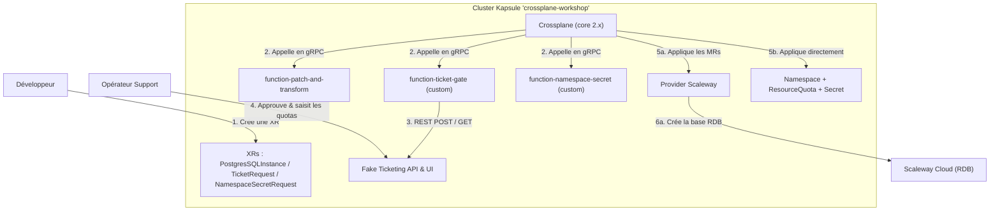

# Atelier Crossplane : Construire son PaaS Interne (IDP) avec Compositions & Composition Functions

Cet atelier reprend **exactement le but** de l'[atelier Kratix](../kratix/README.md) — construire une plateforme de self-service d'infrastructure (Internal Developer Platform) — mais le réalise **intégralement avec Crossplane** : les Promises Kratix sont remplacées par des couples **XRD + Composition**, et les pipelines de workflows par des **Composition Functions**.

Les trois exercices sont les mêmes que dans l'atelier Kratix :
1. **L'automatisation moderne (Composition pure)** : provisionnement en self-service d'une base de données managée Scaleway, entièrement déclaratif (`function-patch-and-transform`).
2. **L'automatisation avec approbation humaine (Ticketing Gating)** : une Composition Function custom qui crée un ticket sur une console de support, suit sa validation manuelle, et compose le Namespace + les Quotas à partir des données saisies par l'approbateur.
3. **La composition dépendante (Pattern Async)** : une Composition Function qui dépend d'une `TicketRequest` approuvée pour injecter un `Secret` dans le namespace provisionné, en s'appuyant sur les *required resources* du protocole RunFunction.

L'intérêt pédagogique est double : apprendre Crossplane (XRD, Compositions, Functions), et **comparer terme à terme** les deux approches — le [tableau de correspondance](#correspondance-kratix--crossplane) sert de fil rouge tout au long de l'atelier.

---

## Résumé

-   **Niveau** : Intermédiaire à Avancé.
-   **Durée cible** : 90 à 120 minutes.
-   **Public** : Consultants Cloud/DevOps OCTO Technology et participants aux formations d'architecture Kubernetes. Avoir suivi l'atelier Kratix est un plus, pas un prérequis.
-   **Environnement cible** : 1 cluster managé **Scaleway Kapsule** (mono-cluster).

---

## Objectifs pédagogiques

À la fin de cet atelier, les participants sauront :
*   Expliquer le modèle Crossplane : XRD (l'API), Composition (l'implémentation), Composite Resource / XR (la requête), Managed Resources (le résultat).
*   Concevoir une Composition purement déclarative (`function-patch-and-transform`) exposant une API simplifiée au-dessus d'un provider cloud.
*   Écrire, packager et déployer une **Composition Function custom en Python** (`function-sdk-python`) qui s'interface avec un système externe (API de ticketing).
*   Gérer un processus d'approbation asynchrone **sans polling bloquant**, en s'appuyant sur la boucle de réconciliation de Crossplane.
*   Exprimer une dépendance entre abstractions via les *required resources* du protocole RunFunction.
*   Comparer point à point l'architecture Crossplane mono-cluster et l'architecture hub/worker de Kratix (StateStore S3 + FluxCD).

---

## Concepts manipulés

*   **Crossplane** : XRD (CompositeResourceDefinition), Compositions (mode Pipeline), Composition Functions, Managed Resources, Providers/ProviderConfig, packages OCI (xpkg).
*   **Réconciliation** : boucle de contrôle Kubernetes, idempotence, état porté par le `status`, garbage collection par ownerReferences.
*   **Infrastructure-as-Code** : OpenTofu/Terraform, provider Scaleway de Crossplane.
*   **Cloud Scaleway** : Kapsule (Kubernetes), Database Instances (RDB), Container Registry (hébergement des functions).

---

## Correspondance Kratix ↔ Crossplane

| Kratix | Crossplane | Commentaire |
|---|---|---|
| Promise | XRD + Composition | La Promise regroupe API et workflow dans un seul objet ; Crossplane les sépare. |
| CRD générée par la Promise | CRD générée par la XRD | Identique pour l'utilisateur final (`kubectl get postgressqlinstances`). |
| Request (CR namespacée) | XR cluster-scoped | Ici en scope Cluster : une XR namespacée ne peut pas composer de ressources cluster-scoped (MRs Scaleway, Namespace). |
| Workflow/Pipeline (Job éphémère) | Pipeline de Functions (Deployments permanents, gRPC) | Le pipeline Kratix peut durer des minutes ; une Function doit répondre en quelques secondes. |
| `/kratix/input/object.yaml` | `req.observed.composite.resource` | La requête de l'utilisateur. |
| `/kratix/output/*.yaml` | `rsp.desired.resources` | Les manifests à créer. |
| `/kratix/metadata/status.yaml` | `rsp.desired.composite` (status) | Le statut exposé à l'utilisateur. |
| Polling bloquant / `write_retry_after` | Re-réconciliation périodique native (~60 s) | Le retry est le fonctionnement normal de Crossplane, pas un mécanisme à programmer. |
| StateStore S3 + FluxCD + Destination | Apply direct par Crossplane | En mono-cluster, plus d'intermédiaire GitOps entre l'intention et la réalisation. |
| Workflow `delete` | Garbage collection (ownerReferences) | La suppression de la XR entraîne celle des ressources composées. |
| RBAC du pod pipeline (lire les TicketRequests) | Required resources résolues par Crossplane | La function *déclare* son besoin ; Crossplane va chercher la ressource. |
| `kratix-sdk` (Python) | `crossplane-function-sdk-python` | Les deux fournissent lecture de la requête, écriture des outputs et du status. |

---

## Architecture cible de l'atelier

Un seul cluster : Crossplane y est à la fois le **control plane** (là où vivent les XRs) et la **cible** (là où atterrissent les ressources composées). C'est la différence structurelle majeure avec l'architecture hub/worker de Kratix.



---

## Prérequis

1.  **Outils locaux** :
    *   `tofu` ou `terraform` (v1.4+)
    *   `kubectl`
    *   le CLI [`crossplane`](https://docs.crossplane.io/latest/cli/) (**requis** : `crossplane xpkg build` empaquette les 2 functions custom à l'étape 1 ; aussi utile pour `crossplane render` et `crossplane beta trace`)
    *   `docker` avec `buildx` (build multi-arch des 2 functions custom)
2.  **Accès Scaleway** :
    *   Un compte Scaleway avec un projet actif.
    *   Des clés API Scaleway valides configurées dans votre environnement :
        ```bash
        export SCW_ACCESS_KEY="votre_access_key"
        export SCW_SECRET_KEY="votre_secret_key"
        export SCW_DEFAULT_PROJECT_ID="votre_project_id"
        ```

---

## Déroulé de l'atelier

### Étape 1 : Provisionner le cluster Scaleway et publier les functions custom

Le Terraform de l'atelier instancie **une seule fois** le module `scaleway-kapsule`, avec Crossplane **2.x** (le mode Pipeline + Functions et la composition de ressources Kubernetes arbitraires utilisés ici nécessitent Crossplane v2). Il installe aussi le Provider Scaleway et son `ProviderConfig`, alimentés par vos clés API, ainsi qu'un **registre de conteneurs Scaleway individuel à cette session** (public, détruit avec le reste par `tofu destroy` — pas de ressource cloud partagée qui survivrait à l'atelier).

```bash
cd demos/crossplane/terraform

tofu init
tofu apply \
  -var="scaleway_access_key=$SCW_ACCESS_KEY" \
  -var="scaleway_secret_key=$SCW_SECRET_KEY" \
  -var="scaleway_project_id=$SCW_DEFAULT_PROJECT_ID" \
  -auto-approve
```
*Note : compter 8 à 12 minutes (cluster Kapsule + Traefik + cert-manager + Crossplane + Provider Scaleway + registre). Terraform applique aussi directement `platform/functions.rendered.yaml` (les 4 Functions), pointées vers votre registre — mais les 2 functions custom resteront `HEALTHY=False` tant que vous n'aurez pas poussé leurs images (étape suivante).*

Configurez ensuite votre contexte :
```bash
export KUBECONFIG=~/.kube/kubeconfig-crossplane-workshop
kubectl get nodes
```

Vérifiez que Crossplane et le Provider Scaleway sont opérationnels :
```bash
kubectl get pods -n crossplane-system
kubectl get providers.pkg.crossplane.io
# provider-scaleway doit être INSTALLED=True et HEALTHY=True
```

#### 1.1 Builder et publier les 2 functions custom sur votre registre de session

```bash
# Toujours depuis demos/crossplane/terraform
printf '%s' "$SCW_SECRET_KEY" | docker login rg.fr-par.scw.cloud -u nologin --password-stdin
REGISTRY="$(tofu output -raw functions_registry)" ../scripts/build-and-push-functions.sh
```
*Note : compter 5 à 10 minutes (build multi-arch amd64/arm64 + push). Une fois le push terminé, Crossplane retente automatiquement le pull des images — inutile de ré-appliquer quoi que ce soit.*

---

### Étape 2 : Installer le RBAC et le service de Ticketing

#### 2.1 Vérifier les Composition Functions

Contrairement aux pipelines Kratix (des Jobs lancés à la demande), les Functions sont des **Deployments permanents** appelés en gRPC par Crossplane. Quatre functions sont utilisées ici — deux communautaires, deux custom construites pour cet atelier — déjà appliquées par Terraform à l'étape 1 :

```bash
kubectl get functions.pkg.crossplane.io
kubectl wait functions.pkg.crossplane.io --all --for=condition=Healthy --timeout=300s
```
*Si `function-ticket-gate`/`function-namespace-secret` ne passent pas `Healthy`, retournez à l'étape 1.1 : le push des images n'est probablement pas terminé.*

#### 2.2 Le RBAC pour composer des ressources Kubernetes arbitraires

En Crossplane v2, une Composition peut créer n'importe quelle ressource Kubernetes (ici : Namespace, ResourceQuota, Secret) — mais le service account de Crossplane n'a pas ces droits par défaut :

```bash
kubectl apply -f demos/crossplane/platform/rbac.yaml
```

> Sans ce ClusterRole, les exercices 2 et 3 échouent avec des events `cannot apply composed resource ... is forbidden`. C'est l'erreur la plus fréquente de cet atelier.

#### 2.3 Le service de Ticketing simulé

Le même service que dans l'atelier Kratix (API REST + console d'approbation) :

```bash
kubectl apply -f demos/crossplane/ticketing-service/service.yaml
kubectl wait deployment/ticketing-service -n ticketing-system --for=condition=Available --timeout=120s

# Dans un terminal dédié : accès à la console d'approbation
kubectl port-forward svc/ticketing-service -n ticketing-system 30080:80
```

La console est alors disponible sur [http://localhost:30080](http://localhost:30080).

---

### Étape 3 : Exercice 1 - L'API d'infrastructure en Composition pure

Objectif : exposer aux développeurs une API `PostgresSQLInstance` minimaliste (taille, version, nom de base, utilisateur) qui provisionne une vraie base PostgreSQL managée chez Scaleway — sans écrire une ligne de code.

#### 3.1 Comprendre la XRD et la Composition

Ouvrez [apis/scaleway-db/xrd.yaml](apis/scaleway-db/xrd.yaml) et [apis/scaleway-db/composition.yaml](apis/scaleway-db/composition.yaml) :

*   la **XRD** joue le rôle de la section `spec.api` de la Promise Kratix : elle génère la CRD `postgressqlinstances.scaleway.octo.com`. Les valeurs par défaut (refs de secrets notamment) sont portées par le schéma OpenAPI, là où la Promise les enfouissait dans son script shell ;
*   la **Composition** remplace le workflow `configure` : les 4 Managed Resources (`Instance`, `Database`, `User`, `Privilege`) que le pipeline Kratix générait en shell (`yq` + heredoc) sont déclarées avec leurs `patches` et `transforms` — le `if [ "$SIZE" = "db-prod" ]` devient un transform `map` ;
*   aucun workflow `delete` : les MRs portent des ownerReferences vers la XR, et leur `deletionPolicy: Delete` propage la suppression jusqu'à l'instance Scaleway réelle.

Astuce : le CLI permet de **prévisualiser localement** ce que la Composition produirait, sans cluster (nécessite Docker) :
```bash
cd demos/crossplane
crossplane render apis/scaleway-db/request-example.yaml apis/scaleway-db/composition.yaml platform/functions-core.yaml
```

#### 3.2 Installer l'API et créer une requête

```bash
kubectl apply -f demos/crossplane/apis/scaleway-db/xrd.yaml
kubectl apply -f demos/crossplane/apis/scaleway-db/composition.yaml

# Le secret contenant les mots de passe (modifiez les valeurs !)
kubectl apply -f demos/crossplane/apis/scaleway-db/secret-example.yaml

# La requête du développeur
kubectl apply -f demos/crossplane/apis/scaleway-db/request-example.yaml
```

#### 3.3 Validation de l'Exercice 1

```bash
# La XR et son avancement
kubectl get postgressqlinstances
crossplane beta trace postgressqlinstance pg-instance-demo

# Les Managed Resources composées
kubectl get instances.rdb.scaleway.upbound.io,databases.rdb.scaleway.upbound.io,users.rdb.scaleway.upbound.io,privileges.rdb.scaleway.upbound.io
```

Critères de réussite (compter **5 à 10 minutes** pour la création de l'instance RDB) :
*   `crossplane beta trace` montre l'arbre XR → 4 MRs, toutes `READY=True` à terme ;
*   l'instance `pg-instance-demo-cluster` est visible dans la console Scaleway (section Databases) ;
*   le secret de connexion `pg-instance-conn-pg-instance-demo` existe dans `crossplane-system`.

#### 3.4 Supprimer l'instance

```bash
kubectl delete postgressqlinstance pg-instance-demo
# Suivre la disparition des MRs (et de l'instance réelle chez Scaleway)
kubectl get instances.rdb.scaleway.upbound.io -w
```

> **Alternative en production : `deletionPolicy: Orphan`.** Comme dans l'atelier Kratix, la politique `Delete` est un choix pédagogique : elle démontre le cycle de vie complet. En production, `Orphan` protège la base d'une suppression accidentelle de la XR — c'est un simple champ à changer dans la Composition.

---

### Étape 4 : Exercice 2 - Le Gating humain avec une Composition Function custom

Objectif : reproduire la Promise de ticketing — un développeur demande un environnement, un ticket est créé dans l'outil interne, un opérateur l'approuve en saisissant le namespace et les quotas, et la plateforme réalise le tout.

#### 4.1 Comment la function remplace le pipeline Kratix

Le pipeline Kratix était un Job Python qui pouvait **poller l'API pendant 180 secondes**. Une Composition Function répond à un appel gRPC avec une deadline de quelques secondes : le modèle change.

À chaque réconciliation de la `TicketRequest` (~60 s), [functions/ticket-gate/function/fn.py](functions/ticket-gate/function/fn.py) fait **une** vérification rapide :

1.  **Pas de `status.ticketId`** → `POST /tickets`, puis écrit le `ticketId` dans le status de la XR. C'est ce status observé qui rend la function idempotente : au prochain appel, le ticket ne sera pas recréé.
2.  **Ticket `Pending`** → met à jour le message de status, et c'est tout. Pas de boucle d'attente : *la prochaine réconciliation est le retry*.
3.  **Ticket `Approved`** → lit les données saisies par l'opérateur (`output_data`) et **compose directement** le `Namespace` et le `ResourceQuota` (capacité Crossplane v2 : composer des ressources Kubernetes arbitraires, sans provider intermédiaire).
4.  **Erreur réseau** → un event `Warning` sur la XR, et on laisse la boucle réessayer.

Là où Kratix demandait `write_retry_after(30s)` et un fichier `workflow-control.yaml`, Crossplane n'a **rien à programmer** : le retry périodique est son fonctionnement de base.

#### 4.2 Installer l'API et créer une requête

```bash
kubectl apply -f demos/crossplane/apis/ticketing/xrd.yaml
kubectl apply -f demos/crossplane/apis/ticketing/composition.yaml
kubectl apply -f demos/crossplane/apis/ticketing/request-example.yaml
```

#### 4.3 Approuver le ticket et valider

```bash
kubectl get ticketrequests
# NAME              SYNCED   READY   COMPOSITION                          AGE
# request-new-env   True     True    ticketrequests.platform.octo.com    15s

kubectl get ticketrequest request-new-env -o jsonpath='{.status}' | jq
# → status: Pending, ticketId: TICKET-1
```

Rendez-vous sur [http://localhost:30080](http://localhost:30080) : le ticket est visible. Approuvez-le en saisissant par exemple `dev-workspace-1` / CPU `4` / Mémoire `8Gi`.

**Patientez jusqu'à une minute** (prochaine réconciliation de la XR — c'est le pendant du `retry_after` de Kratix), puis :

```bash
kubectl get ticketrequest request-new-env -o jsonpath='{.status}' | jq
# → status: Approved, namespaceName: dev-workspace-1, approvedBy, resolvedAt...

kubectl get namespace dev-workspace-1 --show-labels
kubectl get resourcequota platform-quota -n dev-workspace-1 -o yaml
```

Critères de réussite :
*   le status de la XR contient `ticketId`, `status: Approved` et les données saisies par l'opérateur ;
*   le namespace existe, avec les labels `octo.com/ticket-id` et `octo.com/request-name` ;
*   le ResourceQuota reflète les limites saisies dans la console.

Pour observer la function à l'œuvre :
```bash
kubectl logs -n crossplane-system -l pkg.crossplane.io/function=function-ticket-gate --tail=20
```

---

### Étape 5 : Exercice 3 - La dépendance entre abstractions (Pattern Async)

Objectif : une `NamespaceSecretRequest` référence une `TicketRequest` et injecte un `Secret` dans le namespace **une fois le ticket approuvé**. C'est l'équivalent de la Promise dépendante de l'atelier Kratix — sans SDK Kubernetes ni RBAC custom.

#### 5.1 Les *required resources* à la place du client Kubernetes

Le pipeline Kratix utilisait `kubernetes-client` (et un RBAC dédié) pour lire la TicketRequest. Ici, [functions/namespace-secret/function/fn.py](functions/namespace-secret/function/fn.py) **déclare** son besoin :

```python
response.require_resources(
    rsp, "ticket",
    api_version="platform.octo.com/v1alpha1",
    kind="TicketRequest",
    match_name=ticket_request_name,
)
```

Crossplane résout la ressource et **rappelle la function dans la même réconciliation** avec le résultat dans `req.required_resources`. La function n'a ni client API, ni credentials, ni RBAC : elle ne voit que ce que Crossplane lui apporte.

Le branchement reprend le tableau de la Promise Kratix, les délais en moins :

| Statut de la TicketRequest | Kratix (`write_retry_after`) | Crossplane |
|---|---|---|
| Introuvable | retry dans 60 s | status `WaitingDependency`, prochaine réconciliation |
| `Pending` | retry dans 30 s | status `Pending`, prochaine réconciliation |
| `Failed` | retry dans 120 s | status `WaitingDependency`, prochaine réconciliation |
| `Approved` | génère le Secret | compose le Secret, status `Ready` |

#### 5.2 Dérouler le scénario complet

Pour bien observer l'attente de dépendance, créez la `NamespaceSecretRequest` **avant** d'approuver une seconde TicketRequest :

```bash
kubectl apply -f demos/crossplane/apis/namespace-secret/xrd.yaml
kubectl apply -f demos/crossplane/apis/namespace-secret/composition.yaml

# Une seconde demande d'environnement (non approuvée pour l'instant)
kubectl delete ticketrequest request-new-env --ignore-not-found
kubectl apply -f demos/crossplane/apis/ticketing/request-example.yaml

# La demande de secret dépendante
kubectl apply -f demos/crossplane/apis/namespace-secret/request-example.yaml

kubectl get namespacesecretrequest secret-for-qa-env -o jsonpath='{.status}' | jq
# → status: Pending — "en attente d'approbation"
```

Approuvez maintenant le nouveau ticket dans la console (namespace `qa-workspace-1` par exemple), attendez jusqu'à une minute par réconciliation (celle de la TicketRequest, puis celle de la NamespaceSecretRequest), puis :

```bash
kubectl get namespacesecretrequest secret-for-qa-env -o jsonpath='{.status}' | jq
# → status: Ready, namespaceName: qa-workspace-1, secretName: app-config

kubectl get secret app-config -n qa-workspace-1 -o jsonpath='{.data.LOG_LEVEL}' | base64 -d
# → debug
```

Critères de réussite :
*   avant approbation : `status: Pending` (ou `WaitingDependency` si la TicketRequest n'existe pas) et **aucun** Secret créé ;
*   après approbation : `status: Ready` et le Secret présent dans le namespace créé par l'exercice 2, avec le label `octo.com/secret-request`.

---

## Validation globale

```bash
# Les 3 APIs de la plateforme
kubectl get xrd
kubectl get compositions

# Les 4 functions saines
kubectl get functions.pkg.crossplane.io

# L'état de l'ensemble des requêtes
kubectl get postgressqlinstances,ticketrequests,namespacesecretrequests
```

Tout est réussi si : les XRDs sont `ESTABLISHED=True`, les functions `HEALTHY=True`, et chaque XR atteint `READY=True` au terme de son scénario.

---

## Questions de débriefing

1.  Pourquoi une Composition Function ne doit-elle **jamais** faire de polling bloquant, alors que le pipeline Kratix le faisait sans problème ? (Indice : Job éphémère vs appel gRPC avec deadline.)
2.  Où vit l'état entre deux appels d'une function ? Que se passerait-il si la function stockait le `ticketId` dans une variable globale de son process ?
3.  Que gagne-t-on et que perd-on en supprimant l'étage StateStore S3 + FluxCD de Kratix ? Dans quels cas le découplage hub/worker reste-t-il indispensable ?
4.  Où est passé le workflow `delete` de la Promise ? Quel mécanisme Kubernetes le remplace, et quelle est la limite de ce mécanisme si l'on veut un comportement de suppression *différent* de la création ?
5.  Le ClusterRole de `platform/rbac.yaml` donne à Crossplane des droits cluster-wide sur les `secrets`. Quels garde-fous mettriez-vous en production ?
6.  L'approbation du ticket ne déclenche la suite qu'à la réconciliation suivante (≤ 60 s). Comment réduire cette latence sans revenir au polling ? (Pistes : `--poll-interval`, watch des ressources dépendantes.)
7.  Kratix et Crossplane sont-ils concurrents ou complémentaires ? (Kratix peut orchestrer des Compositions Crossplane — c'est d'ailleurs ce que faisait l'exercice 1 de l'atelier Kratix.)

---

## Nettoyage

**L'ordre est critique** : supprimez d'abord les XRs et laissez Crossplane détruire l'instance RDB réelle **avant** de détruire le cluster — sinon l'instance devient orpheline et continue d'être facturée.

```bash
# 1. Supprimer toutes les requêtes
kubectl delete namespacesecretrequests --all
kubectl delete ticketrequests --all
kubectl delete postgressqlinstances --all

# 2. ATTENDRE la disparition complète des Managed Resources RDB
kubectl get instances.rdb.scaleway.upbound.io
# (doit répondre "No resources found" — vérifiez aussi dans la console Scaleway)

# 3. Détruire l'infrastructure
cd demos/crossplane/terraform
tofu destroy \
  -var="scaleway_access_key=$SCW_ACCESS_KEY" \
  -var="scaleway_secret_key=$SCW_SECRET_KEY" \
  -var="scaleway_project_id=$SCW_DEFAULT_PROJECT_ID" \
  -auto-approve
```

Vérifiez dans la console Scaleway qu'il ne reste ni instance RDB, ni Load Balancer, ni cluster Kapsule.

---

## Pour aller plus loin

*   **Multi-cluster avec Crossplane** : reproduire l'architecture hub/worker de Kratix avec `provider-kubernetes` (ObjectS ciblant un kubeconfig distant) — et comparer avec l'approche StateStore.
*   **Claims et scope Namespaced** : refaire l'exercice 1 avec une XRD namespacée et les MRs namespacées (`.m.` APIs) des providers récents, pour retrouver l'isolation par namespace des requests Kratix.
*   **`function-extra-resources`** : la version packagée du mécanisme utilisé à l'exercice 3, utilisable sans écrire de function custom.
*   **Operations (Crossplane v2)** : le pendant Crossplane des workflows impératifs ponctuels.
*   **L'atelier Kratix** ([demos/kratix](../kratix/README.md)) : le même déroulé côté Kratix, idéal en miroir de celui-ci.

---

## Notes pour l'animateur

### Registre et publication des functions custom : un registre par session

Chaque `tofu apply` crée son **propre** namespace de registre Scaleway (`scaleway_registry_namespace.functions` dans `terraform/main.tf`, nom suffixé par un `random_id`), public pour que le package manager de Crossplane tire les images sans `imagePullSecret`. Terraform rend et applique aussi directement `platform/functions.yaml.tpl` → `platform/functions.rendered.yaml` (fichier généré, ignoré par git) avec l'URL de ce registre.

Ce choix (plutôt qu'un registre partagé pré-publié une fois pour toutes) garantit que `tofu destroy` **nettoie intégralement** la session, images comprises — aucune ressource cloud ne survit à l'atelier. La contrepartie : chaque participant build et pousse lui-même les 2 images (étape 1.1 du déroulé), ce qui ajoute `docker`/`buildx`/`crossplane` CLI aux prérequis.

Chaque function a ses tests unitaires (`python -m pytest tests/` dans son dossier) et peut être validée sans cluster avec `crossplane render platform/functions-core.yaml` — ce fichier statique (sans placeholder de registre) ne contient que les 2 functions communautaires, suffisantes pour prévisualiser l'exercice 1.

### Versions épinglées

| Composant | Version | Où |
|---|---|---|
| Crossplane | 2.3.3 | `terraform/variables.tf` (`crossplane_version`) |
| provider-scaleway | v0.6.0 | `terraform/main.tf` |
| function-patch-and-transform | v0.10.7 | `platform/functions.yaml.tpl` |
| function-auto-ready | v0.7.0 | `platform/functions.yaml.tpl` |
| function-sdk-python | 0.14.0 | `functions/*/pyproject.toml` |

### Erreurs fréquentes

*   **`crossplane xpkg push` → `DIGEST_INVALID`** : le registre Scaleway rejette l'upload streamé de go-containerregistry. Le script de build contourne le problème en poussant via le daemon Docker (`docker load` + `docker push` + `docker manifest`).
*   **Function `HEALTHY=False`** : normal tant que l'étape 1.1 (build/push) n'est pas terminée — sinon, image inaccessible (registre non public ?) ou architecture manquante (les images doivent inclure `linux/amd64` pour Kapsule).
*   **Le pod provider-scaleway redémarre 3-4 fois au démarrage** (`no matches for kind ... in version ...m.upbound.io`) : course entre le démarrage du contrôleur et l'établissement de ses ~180 CRDs. Il devient `HEALTHY=True` tout seul en 2-3 minutes.
*   **`cannot apply composed resource ... is forbidden`** : `platform/rbac.yaml` non appliqué (exercices 2 et 3).
*   **Ticket créé en double** : cas limite si l'écriture du status échoue juste après le `POST` (le titre des tickets est préfixé `[<nom-de-la-XR>]` pour s'y retrouver). Limite connue, assumée pédagogiquement.
*   **« Rien ne se passe » après l'approbation** : c'est le délai de réconciliation (≤ 60 s par XR). L'annoncer aux participants avant l'exercice 2 évite les diagnostics inutiles.
*   **`tofu destroy` avant la fin des suppressions RDB** : instance orpheline facturée — bien suivre l'ordre de la section Nettoyage.
