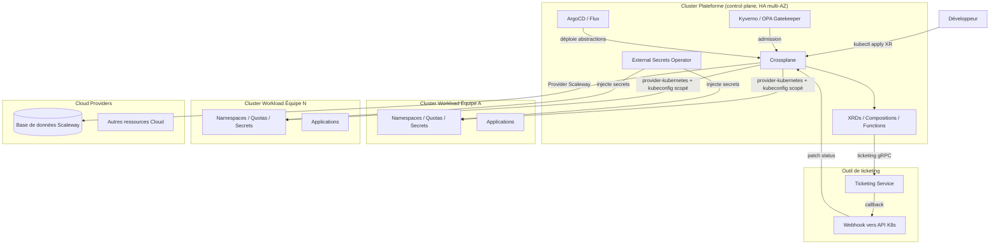

# Recommandations Platform Engineering — Ressources mixtes Cloud + Ticketing

**Contexte** : environ 200 développeurs et 100 ops/devops, avec un besoin d'Internal Developer Platform (IDP) couvrant deux familles de ressources :

1. des ressources **Cloud automatisées** en self-service (ex. base de données Scaleway) ;
2. des ressources **à approbation humaine** via un outil de ticketing, avec des **dépendances** entre les deux (ex. un Secret injecté dans un Namespace créé après approbation).

Ces recommandations découlent du rapport [Kratix vs Crossplane](kratix-vs-crossplane-comparison.md) et des deux ateliers [demos/kratix](../demos/kratix/README.md) et [demos/crossplane](../demos/crossplane/README.md). Elles sont conçues pour être actionnables dans un contexte d'entreprise.

---

## Verdict exécutif

**Retenir Crossplane** comme socle de Platform Engineering. Crossplane est devenu **CNCF Graduated en octobre 2025** ; son modèle de Composition Functions et de `required resources` résout nativement les deux besoins différenciants de ce cas d'usage : l'approbation humaine asynchrone (ticketing) et les dépendances entre abstractions. Kratix reste une option valable uniquement pour des topologies multi-cluster très isolées ou un audit GitOps dur.

---

## Architecture cible recommandée

**Ne pas reproduire l'architecture mono-cluster du workshop en production.** L'atelier Crossplane est mono-cluster pour simplifier la pédagogie, mais un cluster unique devient un point de défaillance unique à 300 utilisateurs. Adopter plutôt :

- un **cluster plateforme dédié** (HA, multi-AZ) qui héberge Crossplane, les XRD et les Compositions ;
- des **clusters workloads séparés** par équipe ou environnement, où atterrissent les ressources Kubernetes composées ;
- `provider-kubernetes` avec des **kubeconfigs scopés** pour que Crossplane compose dans les clusters distants avec les droits du compte de service cible — pas en cluster-admin du control plane.

Cette approche hybride vous donne **le meilleur des deux mondes** : la réconciliation native et les dépendances natives de Crossplane, **et** l'isolation multi-cluster qui était l'atout de Kratix — sans les pièces mobiles supplémentaires de Kratix (bucket S3 + FluxCD + workflows `delete` explicites).

## Décisions clés par domaine

### 1. Provider Cloud et maturité
- Le **cœur Crossplane est mature** (CNCF Graduated, v2 consolidée), **mais le provider Scaleway est en v0.6.0** — pré-1.0. L'atelier lui-même documente des courses au démarrage du provider (~3-4 redémarrages) et un piège `project_id` obligatoire.
- **Épingler les versions** (comme le fait l'atelier : Crossplane 2.3.3, provider-scaleway v0.6.0) et suivre les release notes — attendre des breaking changes tant que le provider n'est pas 1.0.
- **Prévoir une porte de sortie** : pour les ressources Scaleway mal supportées ou instables, utiliser `provider-terraform` ou `function-terraform` pour piloter Terraform depuis Crossplane.
- Si votre cloud principal est AWS, GCP ou Azure, privilégier les **providers Upbound officiels 1.x** qui sont plus matures.

### 2. Ticketing et gating humain
- **Privilégier le pattern webhook/callback** : l'outil de ticketing appelle la plateforme pour patcher le `status` de la XR dès l'approbation. Cela déclenche une réconciliation immédiate et supprime la latence de ~60 s du polling.
- **Conserver la réconciliation périodique comme filet de sécurité** si le webhook échoue.
- **Durcir contre les tickets en double** : ajouter un finalizer sur la XR et vérifier `status.ticketId` avant tout `POST`. L'atelier signale honnêtement ce cas limite ; il faut le corriger avant production.

### 3. Dépendances entre abstractions
- **Utiliser `function-extra-resources`** (citée dans les « Pour aller plus loin » de l'atelier) pour les dépendances standard, et **réserver les functions custom à la vraie logique métier**.
- **Capitaliser** : transformer les deux functions custom de l'atelier (`ticket-gate`, `namespace-secret`) en une **bibliothèque interne de functions** versionnées et réutilisables. C'est le SDK plateforme de l'entreprise.

### 4. Sécurité et isolation
- **Remplacer le `ClusterRole` large** de l'atelier (`namespaces`/`resourcequotas`/`secrets` cluster-wide) par `provider-kubernetes` avec des kubeconfigs scopés par équipe/environnement — principe du moindre privilège.
- **External Secrets Operator + Vault / Scaleway Secret Manager** pour distribuer les credentials de base de données : ne pas faire transiter des mots de passe en clair via des `Secret` Kubernetes du control plane.
- **Kyverno / OPA Gatekeeper** à l'admission des XRs : forcer les enums de `size`, interdire un ProviderConfig prod dans un namespace dev, etc.
- **ProviderConfig multi-tenant** : un `ProviderConfig` par équipe ou environnement, avec des credentials dédiés. L'atelier n'en utilise qu'un seul (`default`) ; en production c'est un risque de blast radius.
- **GitOps les abstractions** (XRD/Compositions/Functions) avec ArgoCD ou Flux sur le cluster plateforme : vous récupérez ainsi la piste d'audit immuable que Kratix offre via son StateStore.

### 5. CI/CD des Composition Functions
L'atelier montre déjà le bon pattern : `pytest`, `Dockerfile`, `pyproject.toml`, `crossplane render` (validation hors cluster), build multi-arch. À industrialiser :
- **Registry privée** pour les functions internes (l'atelier utilise un namespace de registry Scaleway public — passer en privé).
- **Gate de merge** : `pytest` + `crossplane render` + scan d'image (Trivy) + build `linux/amd64`.
- **Versionnement sémantique des packages `xpkg`** et épinglage explicite dans `platform/functions.yaml`.

### 6. Gouvernance des abstractions (API plateforme)
Pour 200 développeurs, l'API de la plateforme **est** le produit :
- **Dépôt Git dédié « plateforme »** versionnant tous les XRD, Compositions et Functions.
- **SemVer du contrat XRD** (ce que les devs consomment) : un breaking change = bump majeur + communication aux équipes.
- **Politique de dépréciation** : mettre `served: false` sur les anciennes versions d'API après un délai de notice.
- **RBAC côté consommateurs** : les devs peuvent créer des XRs (ou des Claims namespacés), mais **jamais éditer** les Compositions.
- **Portail développeur** (Backstage, Port, ou au minimum une documentation `kubectl`-friendly) : le self-service ne fonctionne que si les 200 devs découvrent les abstractions disponibles et leurs exemples.

### 7. Observabilité et SRE de la plateforme
Crossplane expose des `status.conditions`, mais il faut de l'observabilité active :
- **Alertes** : XR bloquée non-Ready au-delà du SLA, `Function Healthy=False`, provider en CrashLoopBackOff (l'atelier documente les redémarrages de provider-scaleway — alertez si le pod ne récupère pas).
- **Métriques métier** : latence de provisioning, taux de succès, temps de lead d'approbation des tickets.
- **Audit** : qui a demandé / qui a approuvé quoi (XRs + audit du ticketing).
- **`deletionPolicy: Orphan`** pour les ressources stateful (BDD) en production. L'atelier utilise `Delete` pour la pédagogie ; orpheliner permet de survivre à une suppression accidentelle de XR.

---

## Roadmap d'adoption progressive

Ne pas tenter le « grand soir ». S'appuyer sur les 3 exercices des ateliers comme squelette :

| Phase | Objectif | Basé sur l'atelier | Durée indicative |
|---|---|---|---|
| **Phase 1 — Quick win** | Self-service BDD purement déclaratif, sans gating | Exercice 1 (scaleway-db) | 1-2 sprints |
| **Phase 2 — Gating** | Approbation humaine via ticketing, async | Exercice 2 (ticketing) | 2-3 sprints |
| **Phase 3 — Dépendances + cross-cluster** | Composition dépendante + clusters cibles via `provider-kubernetes` | Exercice 3 (namespace-secret) + multi-cluster | 2-3 sprints |
| **Phase 4 — Durcissement** | ESO, Kyverno/OPA, ProviderConfig multi-tenant, observabilité, HA, webhook ticketing | — | Continu |

**Phase 1** est la plus importante : elle apporte de la valeur immédiate aux développeurs avec un risque technique faible, et crédibilise l'effort Platform auprès des équipes.

---

## Risques et mitigations

| Risque | Mitigation |
|---|---|
| provider-scaleway en 0.x | Épingler les versions, suivre les releases, prévoir `provider-terraform` comme fallback |
| Crossplane v2 encore récent | S'abonner aux annonces de la communauté, tester les upgrades en non-prod |
| Control plane = point de défaillance unique | HA multi-AZ + backup etcd (les XRs y vivent) |
| Functions = Deployments permanents | Right-size, HPA, monitorer la latence gRPC |
| Ticket créé en double | Finalizer + vérification `status.ticketId` avant `POST` |
| ClusterRole trop large | Remplacer par `provider-kubernetes` + kubeconfigs scopés |

---

## Quand réévaluer Kratix

Uniquement si une **isolation physique multi-cluster** devient une exigence **dure** (workloads régulés, blast radius physique) **et** que `provider-kubernetes` ne suffit pas. Dans la grande majorité des cas, l'hybride **Crossplane + `provider-kubernetes`** couvre les besoins pour lesquels on aurait choisi Kratix, avec un seul outil et un seul modèle mental à maîtriser pour vos 100 ops.

---

## Références

- [Kratix vs Crossplane — Rapport de comparaison](kratix-vs-crossplane-comparison.md)
- [Atelier Kratix](../demos/kratix/README.md)
- [Atelier Crossplane](../demos/crossplane/README.md)
- [CNCF Crossplane project page](https://www.cncf.io/projects/crossplane/)
